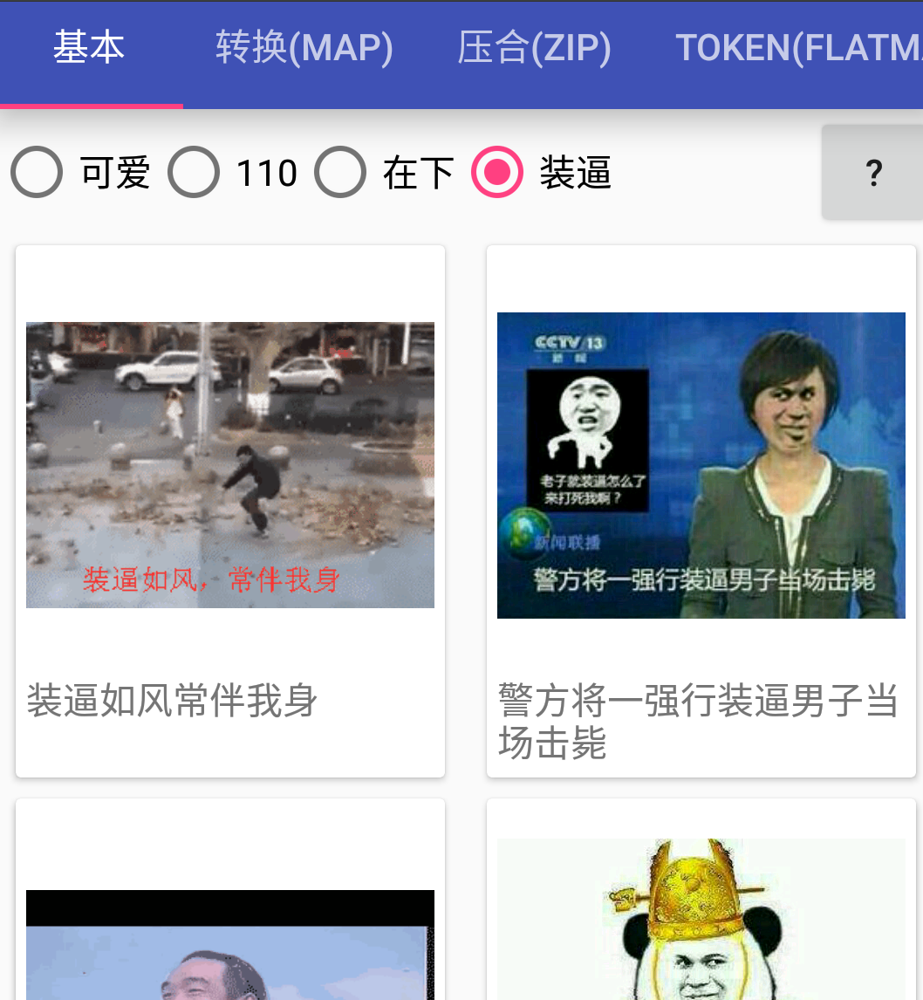
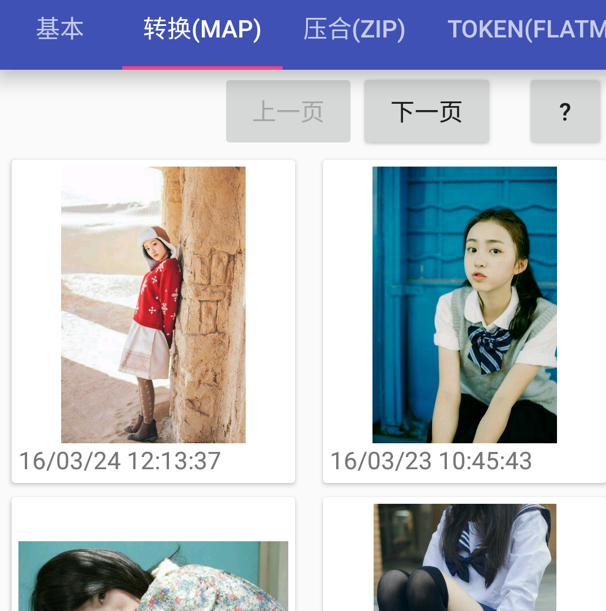
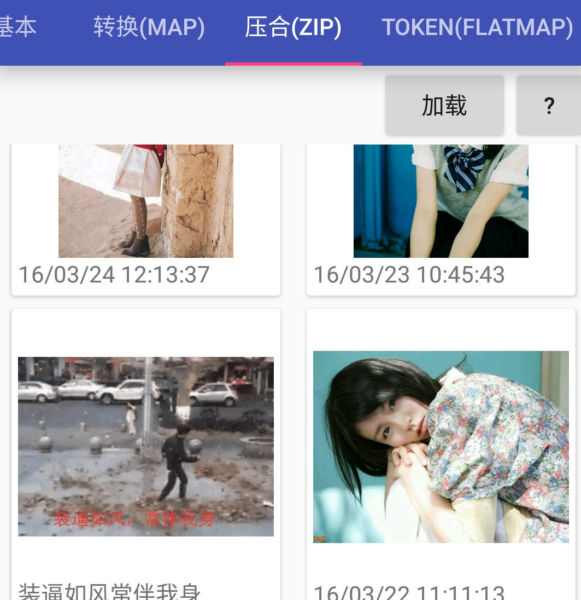
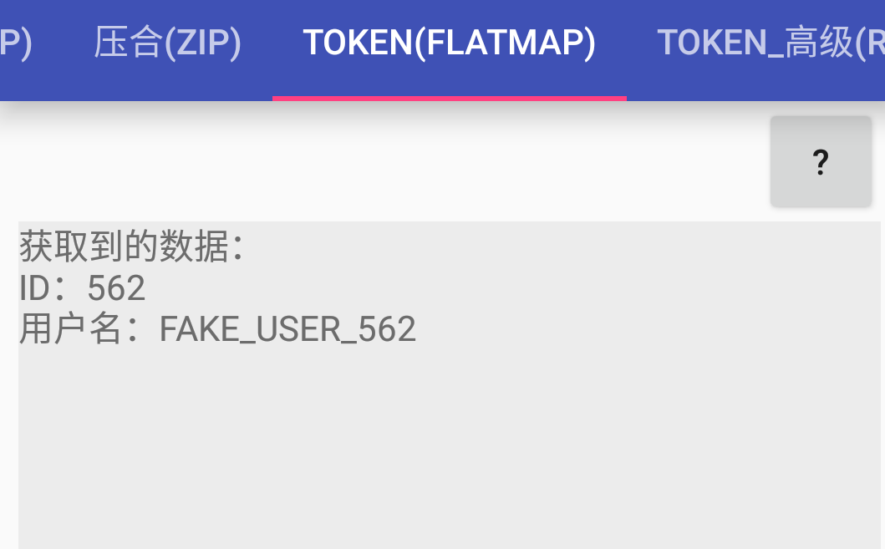
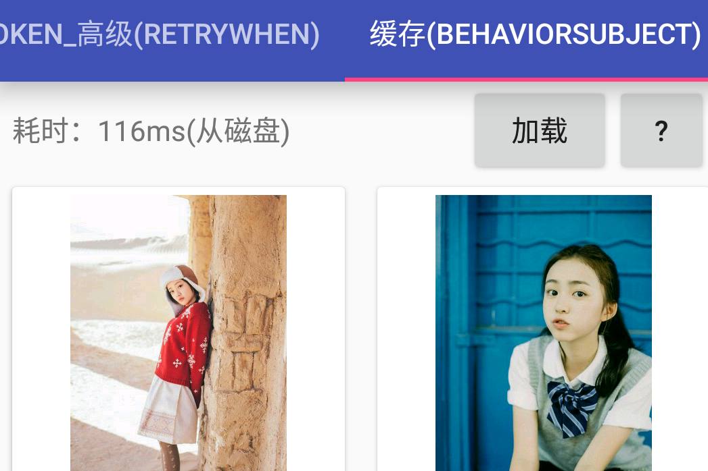

RxSamples
================
RxJava 和 Retrofit 结合使用的几个最常见使用方式举例。

1. **基本使用**

  实现最基本的网络请求和结果处理。
  

2. **转换(map)**

  把返回的数据转换成更方便处理的格式再交给 Observer。
  

3. **压合(zip)**

  将不同接口并行请求获取到的数据糅合在一起后再处理。
  

4. **一次性 token**

  需要先请求 token 再访问的接口，使用 flatMap() 将 token 的请求和实际数据的请求连贯地串起来，而不必写嵌套的 Callback 结构。
  

5. **非一次性 token**

  对于非一次性的 token （即可重复使用的 token），在获取 token 后将它保存起来反复使用，并通过 retryWhen() 实现 token 失效时的自动重新获取，将 token 获取的流程彻底透明化，简化开发流程。
  

6. **缓存**

  使用 BehaviorSubject 缓存数据。
  

### apk 下载
[RxJavaSamples.apk](https://github.com/rengwuxian/RxJavaSamples/releases/download/1.0/RxJavaSamples.apk)